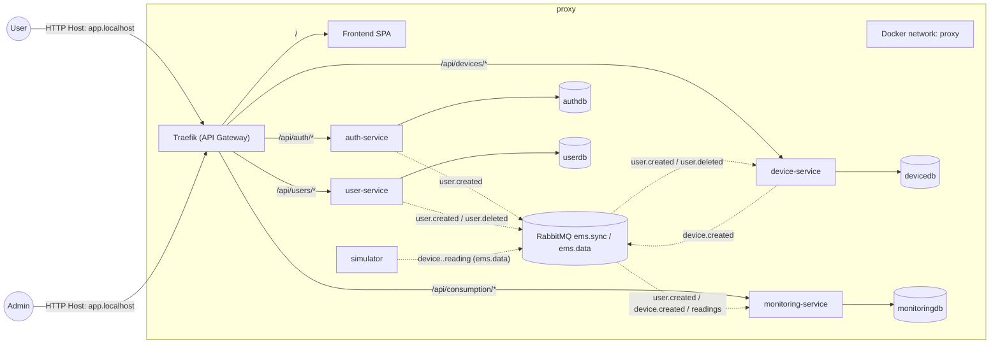

# energy-management-system

Distributed energy management platform built as an event-driven microservice system (Assignment 3 – websockets, chat, load balancing).

## Architecture

- **auth-service** → login/register, issues JWT, exposes `/internal/verify` used by Traefik ForwardAuth
- **user-service** → profiles / roles / admin CRUD (ADMIN only)
- **device-service** → devices CRUD + cascade delete by user, publică `device.created`, consumă `user.deleted`, menține tabel de useri sincronizați
- **monitoring-service** → AMQP consumer, replică user/device, salvează readings + hourly consumption, REST `/api/consumption/day`
- **monitoring-worker-2** → al doilea consumator al cozii de ingest; procesează în paralel aceleași mesaje în baza de date `monitoring`
- **simulator** → producer care publică `device.<ID>.reading` la interval configurabil pe RabbitMQ (`ems.data`)
- **load-balancer** → consumă o singură coadă brută din `ems.data` și redistribuie round-robin către `monitoring.ingest.1` / `monitoring.ingest.2`
- **ws-service** → microserviciu WebSocket care primește evenimente din RabbitMQ (`ems.ws`) și le împinge în timp real către clienți
- **support-service** → chatbot rule-based (10 reguli) cu fallback AI opțional; publică mesaje în `ems.ws` și expune `/api/support/*`
- **RabbitMQ** → trei exchange-uri topic: `ems.data` (readings), `ems.sync` (user/device sync), `ems.ws` (chat + notificări)
- **Postgres** pentru fiecare microserviciu (authdb, userdb, devicedb, monitoringdb)
- **Traefik** → reverse proxy / API gateway pentru toate `/api/*`
- **frontend (React)** → SPA care consumă API-urile (inclusiv grafic zi/oră pentru consum)

## Local development domain

```
http://app.localhost
```

> Frontend is on `/`  
> All APIs are on `/api/...`

## Swagger

| Service         | UI URL                                |
|-----------------|----------------------------------------|
| auth-service    | http://app.localhost/api/auth/swagger-ui.html |
| user-service    | http://app.localhost/api/users/swagger-ui.html |
| device-service  | http://app.localhost/api/devices/swagger-ui.html |
| monitoring-serv.| http://app.localhost/api/consumption/swagger-ui.html (if enabled)

## Start system (Docker)

```
docker compose up --build
```

→ wait until logs show `Started ...` for all services.

If you want faster simulator data for testing:
```
INTERVAL_SECONDS=5 DEVICE_ID=7 docker compose up simulator
```

### Pași de utilizare
1. Accesează `http://app.localhost`, în tab-ul Application șterge `accessToken` dacă există.
2. Register + Login cu user nou (ex. `mihai` / `parola`); în LocalStorage apare `accessToken`.
3. Chat: scrie mesaj în cardul „Chat suport”. Admin poate seta `userId` și răspunde din același card (role ADMIN).
4. Alerte: când simulatorul trimite măsurări peste prag (`APP_OVER_LIMIT_KWH`, default 0.5 kWh), cardul „Notificări supraconsum” se actualizează live.
5. WebSocket: frontend se conectează la `ws://app.localhost/ws?token=<JWT>` (gestionat de `ws-service`); token invalid/expirat => deconectare + logout.

### Chat & notificări (Assignment 3)

- WebSocket endpoint: `ws://app.localhost/ws?token=<JWT>` (gestionat de `ws-service`, autentificare pe baza JWT-ului emis de `auth-service`).
- Chat REST: `/api/support/messages` (user) și `/api/support/admin/reply` (admin); istoric `/api/support/history`.
- Rule-based chatbot cu 10 reguli + fallback AI (setează `OPENAI_API_KEY` în `support-service` pentru răspunsuri LLM).
- Notificări supraconsum: `monitoring-service` trimite evenimente în `ems.ws` când `measurement_value` sau suma pe oră depășește `APP_OVER_LIMIT_KWH` (implicit `0.5` kWh); frontend le afișează live în cardul „Notificări supraconsum”.

## Technologies

| Layer     | Tech |
|----------|------|
| backend  | Spring Boot 3.3 / Java 17 |
| security | Spring Security resource server (JWT) |
| DB       | PostgreSQL 16 |
| proxy    | Traefik v3 |
| frontend | React (SPA build) |
| broker   | RabbitMQ 3.13 |

## Authentication

- login → returns JWT with `authorities` claim (exact Spring format)
- client sends:

```
Authorization: Bearer <token>
```

- admin screens (users/devices) are visible ONLY if JWT contains `ROLE_ADMIN`

## Notes about routing (important)

To avoid SPA swallowing API calls:

```yaml
traefik.http.routers.web.rule = Host(`app.localhost`) && !PathPrefix(`/api`)
```

NEVER use wildcard routing here, otherwise `/api` returns HTML.

## Data flows (Assignment 3)

- **Sync events** (exchange `ems.sync`):
  - `user.created` / `user.deleted` publicate de user-service.
  - `device.created` publicat de device-service la fiecare create.
  - monitoring-service consumă `user.created`/`device.created` și replică tabelele locale; device-service consumă `user.created` (tabel `synced_users`) și `user.deleted` (șterge device-urile acelui `authId`).
- **Readings** (exchange `ems.data` → load-balancer): simulatorul publică `device.<ID>.reading` cu payload `{timestamp, device_id, measurement_value}`; load-balancer-ul consumă o singură coadă (`lb.raw`) și redirecționează round-robin către cozi dedicate fiecărei replici `monitoring.ingest.X`.
- **Aggregare**: monitoring-service face sumă kWh pe oră (UTC) și scrie în `hourly_consumption`.
- **REST consum**: `GET /api/consumption/day?deviceId=<id>&date=YYYY-MM-DD` returnează 24 valori (0–23 ore, kWh).
- **Chat & notificări (exchange `ems.ws`)**:
  - support-service publică evenimente `chat.message` către user + admin (rule-based sau AI fallback).
  - monitoring-service publică `notify.overconsumption` la depășirea pragului `APP_OVER_LIMIT_KWH`.
  - ws-service ascultă `ems.ws`, menține conexiuni WebSocket la `/ws` și distribuie evenimentele în timp real către front-end.

## Sync delete user = delete devices

La `user.deleted` (event din user-service), device-service șterge toate device-urile cu `userAuthId = authId` și curăță tabelul `synced_users`. În monitoringdb, FK-urile au ON DELETE CASCADE dacă ștergi device-ul.

## Diagramă (Mermaid)



---

## Why this architecture

- each service owns its DB  
- no shared schema  
- JWT is the contract between services  
- Traefik is the single entrypoint → production ready

→ identical pattern as modern cloud microservice setups.

---

## Deliverables (checklist)
- Reverse Proxy (Traefik) + Docker deployment ✔️
- Message producer (simulator) + broker (RabbitMQ) ✔️
- Monitoring microservice with AMQP consumer + hourly aggregation + DB ✔️
- User/Device sync events via `ems.sync` ✔️
- Client chart: frontend consumes `/api/consumption/day` (line/bar chart day view) ✔️
- Deployment diagram: see `docs/deployment.puml` (PlantUML) ✔️
- README (acest fișier) ✔️

## Quick answers (3.1)
- Queue vs Topic: queue = point-to-point, un singur consumator primește mesajul; topic (pub/sub) permite mai mulți consumatori să primească același mesaj.
- Point-to-Point vs Publish-Subscribe: P2P trimite un mesaj unui singur consumer (work queue); Pub/Sub broadcast către toți subscriberii.
- MOM rol: decuplează producători/consumatori, persistă mesaje, asigură routing și livrare fiabilă.

## Contact

This project was built as a DS lab microservice system for an Energy management platform.
flowchart LR
    subgraph proxy["Docker network: proxy"]
        T[Traefik]
        W[Frontend SPA (web)]

        A[auth-service]
        U[user-service]
        D[device-service]
        M[monitoring-service]
        S[simulator]

        AD[(authdb)]
        UD[(userdb)]
        DD[(devicedb)]
        MD[(monitoringdb)]

        MQ[(RabbitMQ: ems.data / ems.sync)]
    end

    User((User)) -->|HTTP Host: app.localhost| T

    T -->|"/"| W
    T -->|"/api/auth/*"| A
    T -->|"/api/users/*"| U
    T -->|"/api/devices/*"| D
    T -->|"/api/consumption/*"| M

    A --> AD
    U --> UD
    D --> DD
    M --> MD

    A -->|user.created| MQ
    U -->|user.created / user.deleted| MQ
    D -->|device.created| MQ
    S -->|device.<id>.reading (ems.data)| MQ
    MQ -->|sync + data| M
